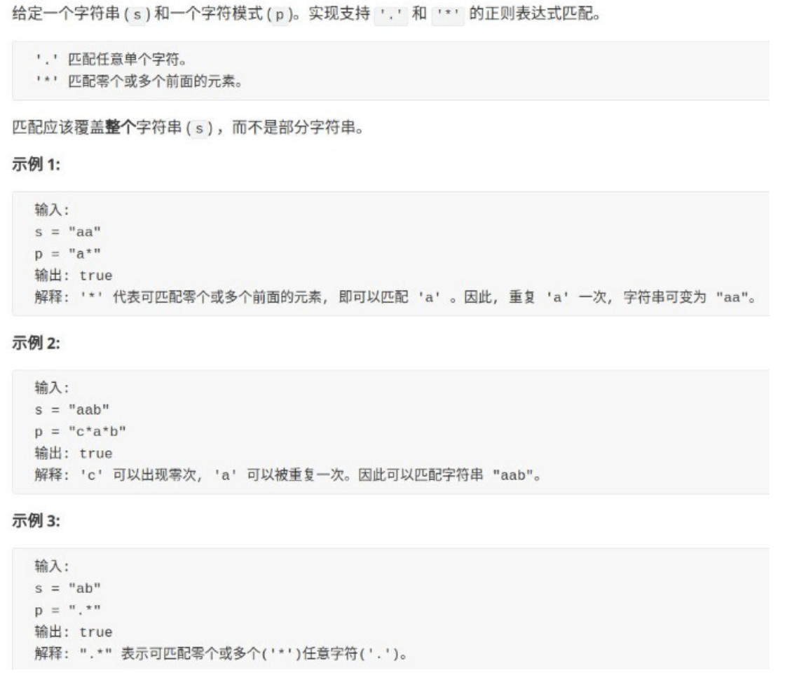

# 动态规划之正则表达



## ⼀、不考虑通配符情况

第⼀步，我们暂时不管正则符号，如果是两个普通的字符串进⾏⽐较，如何 进⾏匹配？我想这个算法应该谁都会写：

```cpp
 bool isMatch(string text, string pattern) { 
        if (text.size() != pattern.size()) 
        return false; 
        for (int j = 0; j < pattern.size(); j++) { 
            if (pattern[j] != text[j]) 
            return false; 
        }
        return true; 
    }
```

稍微改造⼀下上⾯的代码，略微复杂了⼀点，但意思还是⼀样的:

```cpp
bool isMatch(string text, string pattern) { 
       int i = 0; // text 的索引位置 
       int j = 0; // pattern 的索引位置 
       while (j < pattern.size()) { 
           if (i >= text.size()) 
           return false; 
           if (pattern[j++] != text[i++]) 
           return false; 
        }// 相等则说明完成匹配 
        return j == text.size(); 
    }
}
```

如上改写，是为了将这个算法改造成递归算法（伪码）：

```python
def isMatch(text, pattern) -> bool: 
    if pattern is empty: return (text is empty?) 
    first_match = (text not empty) and pattern[0] == text[0] 
    return first_match and isMatch(text[1:], pattern[1:])
```

## ⼆、处理点号「.」通配符

点号可以匹配任意⼀个字符，稍加改造即可：

```python
def isMatch(text, pattern) -> bool: 
    if not pattern: return not text 
    first_match = bool(text) and pattern[0] in {text[0], '.'} 
    return first_match and isMatch(text[1:], pattern[1:])
```

## 三、处理「\*」通配符

星号通配符可以让前⼀个字符重复任意次数，包括零次。那到底是重复⼏次 呢？

这似乎有点困难，不过不要着急，我们起码可以把框架的搭建再进⼀ 步：

```python
def isMatch(text, pattern) -> bool: 
    if not pattern: return not text 
    first_match = bool(text) and pattern[0] in {text[0], '.'} 
    if len(pattern) >= 2 and pattern[1] == '*': 
        # 发现 '*' 通配符 
    else:
        return first_match and isMatch(text[1:], pattern[1:])
```

